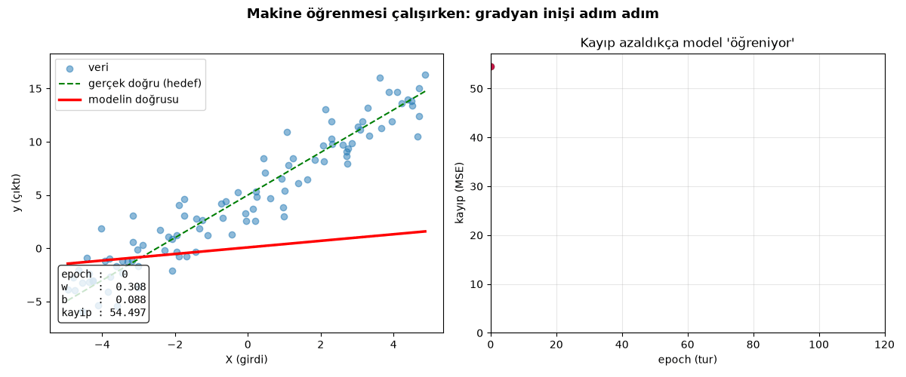

# Makine Öğrenmesinin Temeli — Sıfırdan Doğrusal Regresyon

Bu küçük proje, **makine öğrenmesinin en temel fikrini** hiçbir hazır ML
kütüphanesi kullanmadan (scikit-learn yok, TensorFlow yok — sadece NumPy)
satır satır anlatır:

> Bir model, veriye bakarak "kuralı" nasıl kendi kendine bulur?



Yukarıdaki animasyonda **kırmızı doğru** model. Başta rastgele (düz, yatık)
duruyor; her turda (epoch) verilere biraz daha iyi oturuyor ve sağdaki
**kayıp (hata) eğrisi** aşağı iniyor. İşte "öğrenme" tam olarak budur.

---

## Fikir tek cümlede

Elimizde girdi–çıktı çiftleri var: `(X, y)`. Bir doğru denklemi kuruyoruz:

```
y_tahmin = w * x + b
```

`w` (eğim) ve `b` (kesişim) modelin **parametreleri**. Öğrenme, bu iki
sayıyı tahminler gerçeğe en yakın olacak şekilde ayarlamaktır.

---

## Nasıl öğreniyor? — 4 adımlık döngü

Bu döngü sadece doğrusal regresyonun değil, **tüm derin öğrenmenin** de kalbidir:

| Adım | Ne yapılır | Kodda |
|------|------------|-------|
| 1. İleri geçiş | `w` ve `b` ile tahmin yap | `tahmin_et()` |
| 2. Kayıp | Tahmin gerçekten ne kadar sapmış? (MSE) | `kayip_hesapla()` |
| 3. Geri geçiş | Kaybı azaltmak için hangi yöne gitmeli? (gradyan / türev) | `gradyan_hesapla()` |
| 4. Güncelleme | Parametreleri o yönün tersine küçük bir adım kaydır | `egit()` içinde |

```
yeni_w = w - ogrenme_orani * (dKayıp / dw)
yeni_b = b - ogrenme_orani * (dKayıp / db)
```

Bu yönteme **gradyan inişi (gradient descent)** denir. `ogrenme_orani`
(learning rate) adım büyüklüğüdür: çok büyükse model ıraksar (patlar),
çok küçükse çok yavaş öğrenir.

---

## Kayıp fonksiyonu: Ortalama Kare Hata (MSE)

```
MSE = (1/n) · Σ (y_tahmin − y_gerçek)²
```

Karesini alıyoruz çünkü:
- Artı/eksi hatalar birbirini götürmesin,
- Büyük hatalar daha çok cezalandırılsın,
- Türevi pürüzsüz olsun (gradyan inişi için şart).

---

## Kavram sözlüğü

- **Örnek (sample):** tek bir veri noktası `(x, y)`
- **Özellik (feature):** girdi değişkeni (burada tek: `x`)
- **Parametre:** modelin öğrendiği sayı (`w`, `b`)
- **Hiperparametre:** biz elle seçeriz (`ogrenme_orani`, `epoch_sayisi`)
- **Epoch:** tüm veriyi bir kez baştan sona görmek
- **Yakınsama (convergence):** kaybın artık düşmemeye başlaması

---

## Çalıştırma

```bash
pip install -r requirements.txt

# 1) Modeli eğit, sonucu grafikle gör (sonuc.png üretir)
python dogrusal_regresyon.py

# 2) Öğrenme sürecinin animasyonunu üret (egitim_animasyonu.gif üretir)
python animasyon.py
```

### Örnek çıktı

```
  Gizli gerçek kural:  y = 2.0 * x + 5.0
  ...
epoch   0 | kayip =  54.497 | w = 0.308 | b = 0.088
epoch  40 | kayip =   8.307 | w = 1.823 | b = 2.750
epoch 120 | kayip =   3.434 | w = 1.891 | b = 4.521
epoch 199 | kayip =   3.235 | w = 1.905 | b = 4.878
  ÖĞRENİLEN model:  y = 1.905 * x + 4.878
  GERÇEK  model:    y = 2.000 * x + 5.000
```

Model, `w=2` ve `b=5` değerlerini **hiç görmeden**, sadece gürültülü
verilere bakarak neredeyse doğru buldu. Kalan küçük fark verideki
gürültüden kaynaklanır — bu normaldir.

---

## Denemeye değer

- `ogrenme_orani` değerini `0.1` yap → çok daha hızlı yakınsar. `0.5` yap → patlar.
- `epoch_sayisi` artır → `b` gerçek değere (5) daha çok yaklaşır.
- `gurultu` sapmasını büyüt → doğru aynı kalır ama kayıp tabanı yükselir.

---

## Dosyalar

| Dosya | İçerik |
|-------|--------|
| `dogrusal_regresyon.py` | Modelin kendisi — her satırı yorumlarla açıklanmış |
| `animasyon.py` | Eğitimi kare kare GIF'e döken görselleştirme |
| `egitim_animasyonu.gif` | Öğrenme animasyonu |
| `sonuc.png` | Eğitim sonrası tek kare özet grafik |
